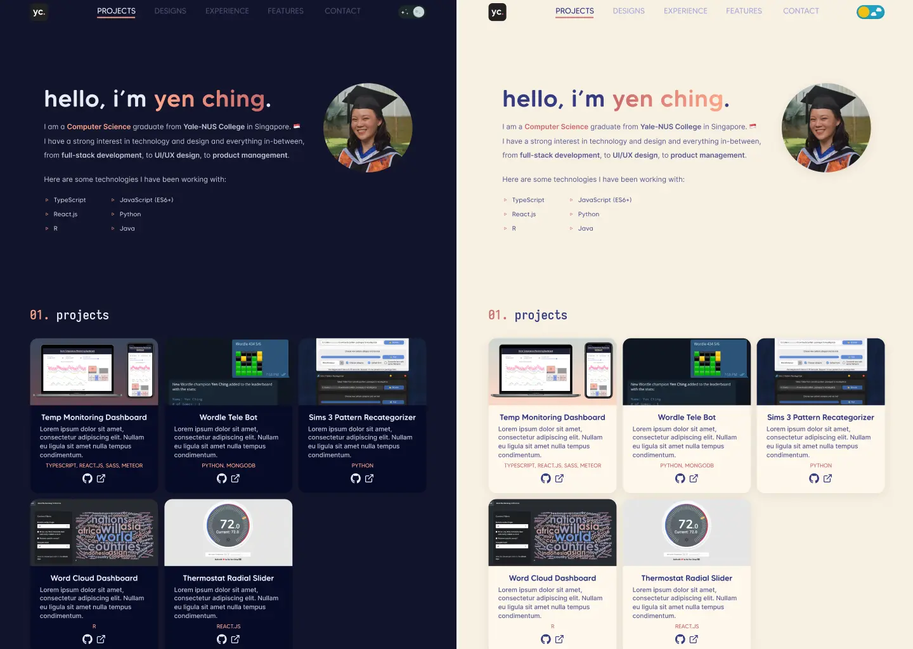

<div align="center">
  
</div>
<h1 align="center">yauyc.com Personal Portfolio</h1>
<p align="center">
  <a href="https://app.netlify.com/sites/yauyc/deploys"></a>
  
  
  
  
  
</p>
My personal portfolio site coded in React.js and TypeScript. Built with Chakra UI and Next.js, and hosted with Netlify.

## 💡 Motivation

I always found that a 1-page resume could never fit everything I wanted to say about myself. So I wanted to build a portfolio site, so that I had full freedom over the presentation of my narrative. I also saw it as a great way to exercise my design and technical chops!

## ✨ Preview

<div align="center">
  <div align="center" style="display:block;">
    
  </div>
  <h3>🔗 Check out the live site at <a href="https://yauyc.com">yauyc.com</a></h3>
</div>

## ⭐ Features

- Light and dark mode toggle (follows system default)
- Responsive design (fits all viewport sizes including desktop, tablet, mobile)
- Sliding navigation link highlight based on current section in viewport using Intersection Observer API

## 📝 License

This project is licensed under the MIT License - see the [LICENSE](https://github.com/yauyenching/portfolio-site/blob/main/LICENSE) file for details. This means you can fork this repo and use this code for your own personal/commerical uses, but please provide attribution!

## ⚙️ Building this Project

1. First, run
    ```
    npm install
    ```
    to install project dependencies.

2. Then, run the development server:
    ```bash
    npm run dev
    # or
    yarn dev
    ```

3. Open [http://localhost:3000](http://localhost:3000) with your browser to see the result. You can start editing the page by modifying `pages/index.tsx`. The page auto-updates as you edit the file.

## 📖 Documentation

### 📂 File Structure

```
components/                     # React components
pages/
    sections/                   # component for each site section
    index.tsx                   # root React element
public/                         # static assets
styles/                         # global styles and component theming
```

## 🤔 Future

The following is a list of features to implement:

- [x] Design cards overhaul: redesign cards and add description text
- [ ] Design cards overhaul: add Modal content for each project
- [ ] Hover animations
  - [x] Drop shadows
  - [x] Buttons
  - [ ] [optional] Gradient text
- [ ] Link tooltips
- [ ] Accessibility: Link aria labels
- [ ] Optimization: preload fonts and images
  - [x] Preload fonts
  - [] Images
- [ ] [optional] Scroll animations (must be performant)

## 🙌🏻 Acknowledgements

Thank you to the [Brittany Chiang](brittanychiang.com/), [Leonard Tng](leonardtng.com/), and [Hana Nabilah](https://raihanahnabilah.github.io/) whose personal sites I referenced when designing my site.